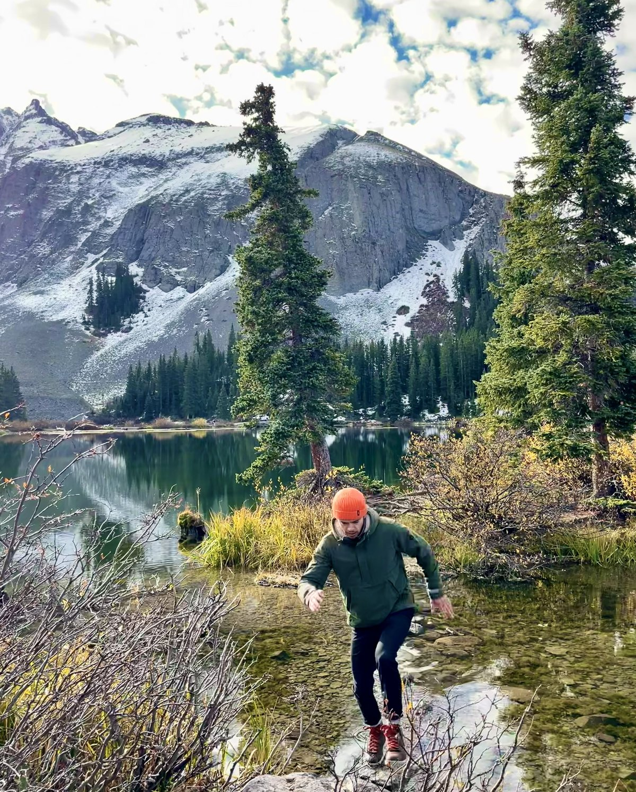
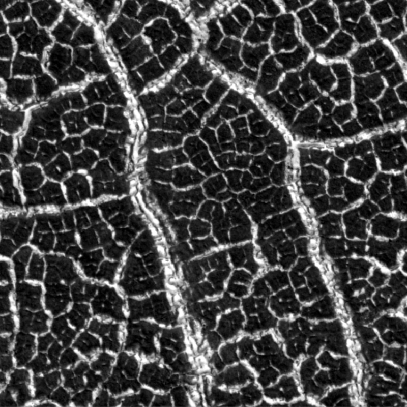
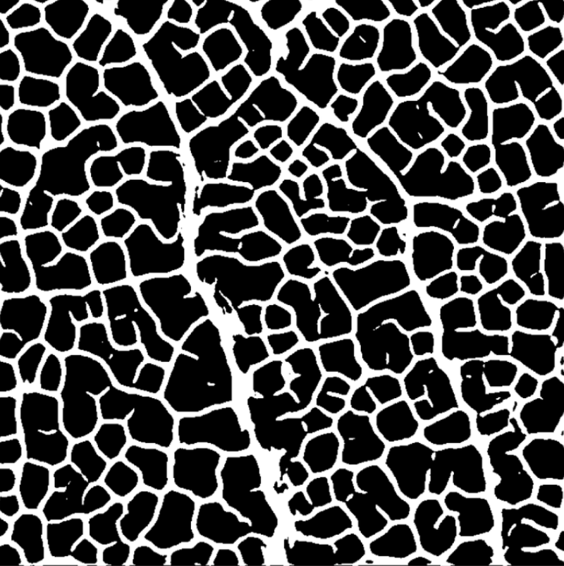
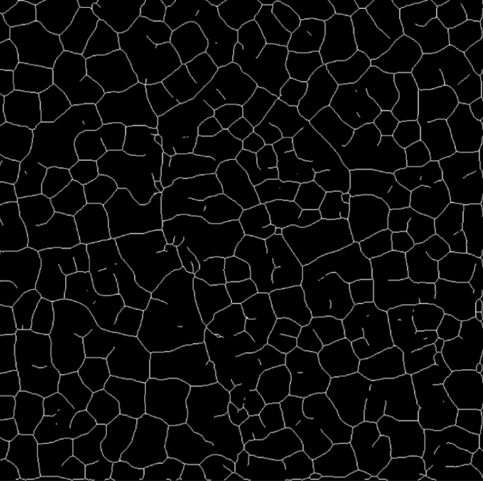
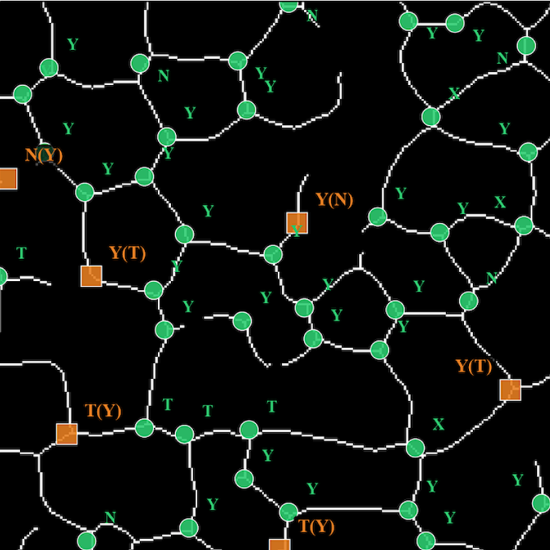
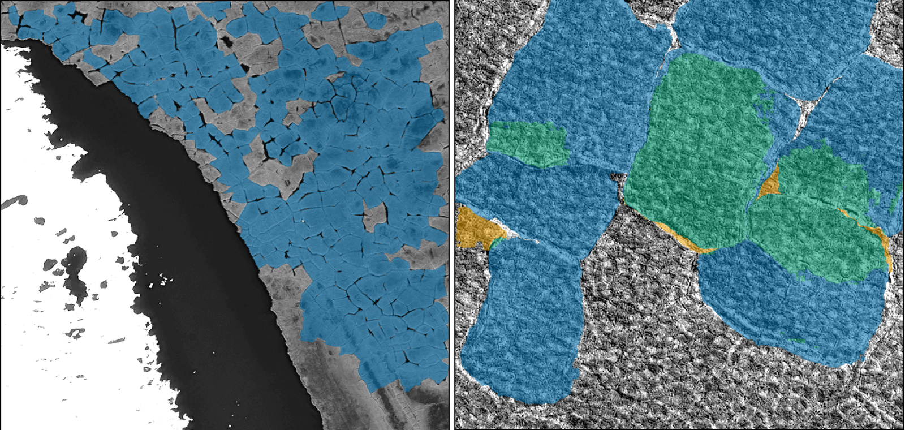
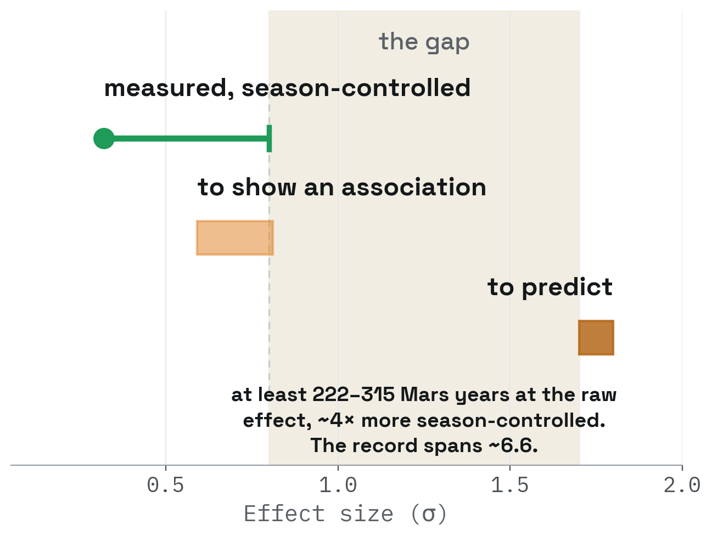

```{=html}
<canvas class="site-field" aria-hidden="true"></canvas>

<section class="hero">
  <div class="hero-inner">
    <div class="hero-text">
    <div class="hero-id">
      <div class="hero-name">Andrew Foerder</div>
      <div class="hero-role">PhD candidate, Earth, Environmental &amp; Planetary Sciences</div>
    </div>

    <h1 class="hero-claim">Applying AI to help solve problems on Earth and Elsewhere</h1>

    <p class="hero-lede">Raw archive to measured result: deep learning and computer
    vision for detection and classification in imagery, from the ground to orbit.</p>


    </div>

    <div class="hero-portrait">
      
    </div>
  </div>

</section>

<div class="sheet">

<div class="split split-lead">

  <div class="prose">
    <p>I'm a PhD candidate in Earth, Environmental, and Planetary Sciences at the University of
    Tennessee, Knoxville, working with Dr. Bradley J. Thomson and defending in
    Spring 2027. After that, I'm looking for applied and research scientist roles in
    Earth observation, geospatial machine learning, and AI for science.</p>

    <p>I came to AI/ML from the planetary geology side. My undergraduate and
    master's work focused on Antarctic geochemistry, using the McMurdo Dry Valleys as
    a stand-in for Mars. Then, during my Ph.D., I went to a NASA AI workshop in 2024
    and saw how these methods could be applied to planetary geoscience problems. So I
    rebuilt my dissertation around them. I taught myself deep learning by building
    the detection pipeline that work required, on a problem where the training data
    didn't exist and had to be made.</p>

    <p>Most of what I do sits in the space between a model and a scientific claim:
    build the pipeline, evaluate it honestly, then defend what its output does and
    doesn't support. The domain changes but the problem doesn't: scarce labels, a
    large archive, and a result someone has to stake a decision on. That combination
    shows up everywhere. It's why a paleobiology group recently brought me in to
    help apply machine learning to their data, and it's why most of my day-to-day is
    translation: turning model outputs into something a domain expert can use, and
    helping junior contributors become people who can build the models themselves.</p>

    <p>When the tooling I need doesn't exist, I build it. For example, labels were
    the bottleneck for a project in my dissertation, so I built an annotation app to
    expedite labeling and dataset curation.</p>

    <p>I also put real effort into deciding whether a problem even calls for an AI
    model, and I'm willing to say so when it doesn't. Some of my work has shown that
    a question wasn't answerable with the data available, which is a less satisfying
    result to report but a more useful one to have. Preferring the useful answer over
    the satisfying one isn't a research method, it's just how I'm wired.</p>

    <p>Away from the screen I'm usually getting green on my eyeballs, in my garden
    where I grow pumpkins timed for October, or on the rides and hikes around
    Boulder, as well as in Canyonlands for an annual hundred-mile ride with
    friends.</p>

    

    <p>The person you get is the same one on this
    page: incurably curious, and always working on getting better at what I do.
    I'm not interested in being some polished version of myself at work, and I
    genuinely believe that openness is what lets people with different skills combine
    them and point them at a common goal. If that sounds like someone you'd want to
    work with, get in touch.</p>
  </div>

  <div class="rail">
    <h4>Education</h4>
    <ul>
      <li>Ph.D. Earth, Environmental &amp; Planetary Sciences<br>
        <span class="sub">University of Tennessee, Knoxville · 2027 (expected)</span></li>
      <li>M.Sc. Earth &amp; Planetary Sciences<br>
        <span class="sub">University of Hawai'i at Mānoa · 2020</span></li>
      <li>B.A. Geology-Biology<br>
        <span class="sub">Brown University · 2018</span></li>
    </ul>

    <h4>Eligibility</h4>
    <p class="sub">U.S. citizen, eligible to obtain a security clearance.</p>

    <h4>Find me</h4>
    <ul class="rail-links">
      <li><a href="mailto:andrewfoerder66@gmail.com">Email</a></li>
      <li><a href="resume.pdf" target="_blank" rel="noopener">Résumé (PDF)</a></li>
      <li><a href="cv.pdf" target="_blank" rel="noopener">Academic CV (PDF)</a></li>
      <li><a href="https://github.com/afoerder">GitHub</a></li>
      <li><a href="https://scholar.google.com/citations?user=LkSwiQIAAAAJ&hl=en">Google Scholar</a></li>
      <li><a href="https://www.linkedin.com/in/andrew-foerder-79a830b0">LinkedIn</a></li>
      <li><a href="https://orcid.org/0009-0001-4430-0844">ORCID</a></li>
    </ul>
  </div>

</div>

<div class="band">
  <div class="section-head">Selected work</div>
  <div class="cards">

    <div class="card">
      <div class="card-stage">
        <div class="stage-frame">
          
          
          
          
        </div>
      </div>
      <h3>Martian paleoclimate by counting cracks</h3>
      <p class="card-line">The way cracks meet in frozen ground can record past
      climate conditions, but with over 100,000 orbital images to search, reading
      them by hand is not an option. I built an AI vision pipeline that detects
      and classifies martian crack junctions, validated on a subset of HiRISE scenes
      and scaling next to the martian mid-latitudes.</p>
      <span class="card-status">Under review · scale-up in progress</span>
    </div>

    <div class="card">
      
      <h3 class="split-head">
        <span>Training on Earth</span><span class="sep">....</span><span>deploying on Mars</span>
      </h3>
      <p class="card-line">Can an AI vision model trained only on Earth imagery find the
      same landforms on Mars? I trained segmentation models on polygon-patterned
      tundra, ancient riverbeds preserved as ridges, and branching valley networks,
      then set them loose on Mars.</p>
      <span class="card-status">Results in preparation</span>
    </div>

    <div class="card">
      
      <h3>Knowing a record's limit</h3>
      <p class="card-line">Can a Martian dust storm be predicted? Researchers have
      reported warning signs for decades, yet none has been shown to beat two
      forecasts that cost nothing: what the season usually brings, and what the storm
      is already doing. So I asked whether the record holds enough storms to prove
      that any warning sign works.</p>
      <span class="card-status">In preparation</span>
    </div>

  </div>
</div>


<div class="band band-pubs">
  <div class="section-head">Selected publications</div>

  <div class="pub">
    <span class="venue">Under review · JGR Machine Learning and Computation</span>
    <div class="cite">Foerder, A. B., Magocs, B. L., Thomson, B. J., and Bhidya, H.
    Toward paleoclimate mapping on Mars by detecting and classifying fracture
    junctions with machine learning.</div>
  </div>

  <div class="pub">
    <span class="venue">LPSC 2026 · Abstract 1717</span>
    <div class="cite">Foerder, A. B., Thomson, B. J., Magocs, B. L. (2026)
    Earth-to-Mars Transfer Learning: A Novel Method for the Automatic Detection of
    Volatile-Influenced Landforms on Mars.
    <a href="https://www.hou.usra.edu/meetings/lpsc2026/pdf/1717.pdf">PDF</a></div>
  </div>

  <p class="meta" style="margin-top:1.5rem"><a href="publications.html">Full publication list</a></p>
</div>

</div>


```
