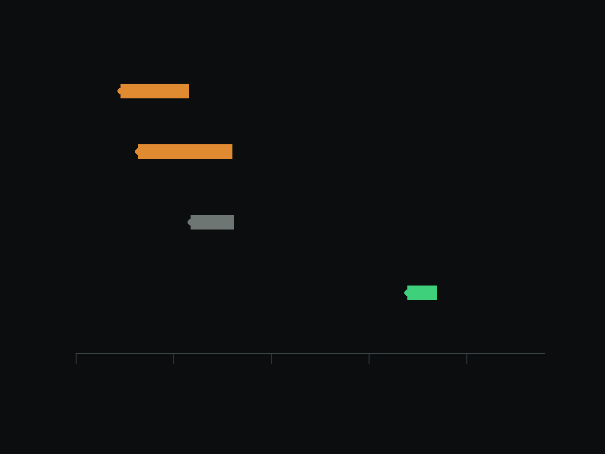

```{=html}
<canvas class="site-field" aria-hidden="true"></canvas>

<section class="hero">
  <div class="hero-inner">
    <div class="hero-text">
    <div class="hero-id">
      <div class="hero-name">Andrew Foerder</div>
      <div class="hero-role">Machine learning · Earth and planetary remote sensing</div>
    </div>

    <h1 class="hero-claim">I measure what’s too big to map by hand.</h1>

    <p class="hero-lede">Computer vision for detection and measurement in orbital
    imagery, where the labels do not exist yet.</p>


    </div>

    <div class="hero-portrait">
      
    </div>
  </div>

</section>

<div class="sheet">

<div class="split split-lead">

  <div class="prose">
    <p>I'm a PhD candidate in Earth and Planetary Sciences at the University of
    Tennessee, Knoxville, working with Dr. Bradley J. Thomson and defending in
    Spring 2027. After that, I'm headed for applied and research scientist roles in
    Earth observation, geospatial machine learning, and AI for science.</p>

    <p>I came to machine learning from the geology side. My earlier work was
    Antarctic geochemistry, using the McMurdo Dry Valleys as a stand-in for Mars,
    and it meant measuring samples one at a time. Then at a NASA AI workshop in 2024
    I saw what these methods could do on problems I already cared about, and I went
    home and rebuilt my dissertation around them. I learned deep learning by building
    that pipeline, on a problem where the training data didn't exist and had to be
    made.</p>

    <p>Most of what I do sits in the space between a model and a scientific claim:
    build the pipeline, evaluate it honestly, then defend what its output does and
    doesn't support. The domain changes but the problem doesn't: scarce labels, a
    large archive, and a result someone has to stake a decision on. That combination
    shows up everywhere, which is why a paleobiology group recently brought me in to
    help apply machine learning to their data, and why a lot of my day-to-day is
    translating between models and the domain experts who don't build them, or
    bringing junior contributors up to speed on the technical side.</p>

    <p>When the tooling I need doesn't exist, I build it. Labels were the bottleneck
    on my dissertation, so I built an annotation app to clear it. I've since built a
    verification layer that holds my AI-assisted work to source-checking and evidence
    standards, because I'd rather catch my own errors than have a reviewer do it. And
    I spend real effort deciding whether a problem calls for a model at all. Some of
    my work has been showing that a question wasn't answerable with the data
    available, which is a less satisfying result to report and a more useful one to
    have.</p>
  </div>

  <div class="rail">
    <h4>Education</h4>
    <ul>
      <li>Ph.D. Earth, Environmental, and Planetary Sciences<br>
        <span class="sub">University of Tennessee, Knoxville · in progress</span></li>
      <li>M.S. Planetary Geology<br>
        <span class="sub">University of Hawai'i at Mānoa</span></li>
      <li>B.S. Geology-Biology<br>
        <span class="sub">Brown University</span></li>
    </ul>

    <h4>Eligibility</h4>
    <p class="sub">U.S. citizen, eligible to obtain a security clearance.</p>

    <h4>Find me</h4>
    <ul class="rail-links">
      <li><a href="mailto:REPLACE@example.com">Email</a></li>
      <li><a href="cv.pdf">Curriculum Vitae (PDF)</a></li>
      <li><a href="https://github.com/afoerder">GitHub</a></li>
      <li><a href="https://scholar.google.com/citations?user=LkSwiQIAAAAJ&hl=en">Google Scholar</a></li>
      <li><a href="https://www.linkedin.com/in/andrew-foerder-79a830b0">LinkedIn</a></li>
      <li><a href="https://orcid.org/0009-0001-4430-0844">ORCID</a></li>
    </ul>
  </div>

</div>

<div class="band">
  <div class="section-head">Selected work</div>
  <div class="cards">

    <div class="card">
      <div class="card-stage">
        <div class="stage-frame">
          
          
          
          
        </div>
      </div>
      <span class="card-status">Under review · scale-up in progress</span>
      <h3>Martian paleoclimate by counting cracks</h3>
      <p class="card-line">The way cracks meet in frozen ground can record past
      climate conditions, but with over 100,000 orbital images to search, reading
      them by hand is not an option. I built a deep learning pipeline that detects
      and classifies martian crack junctions, validated on a subset of HiRISE scenes
      and scaling next to the martian mid-latitudes.</p>
    </div>

    <div class="card">
      
      <span class="card-status">Results in preparation</span>
      <h3>Training on Earth, deploying on Mars</h3>
      <p class="card-line">Can a vision model trained only on Earth imagery find the
      same landforms on Mars? I trained segmentation models on arctic tundra polygons,
      inverted channels, and valley networks, then tested them on Mars.</p>
    </div>

    <div class="card">
      
      <span class="card-status">In preparation</span>
      <h3>Knowing a record's limit</h3>
      <p class="card-line">Can a Martian dust storm be predicted? Researchers have
      reported warning signs for decades, yet none has been shown to beat two
      forecasts that cost nothing: what the season usually brings, and what the storm
      is already doing. So I asked whether the record holds enough storms to prove
      that any warning sign works. It does not. Mars has produced only about a dozen
      independent major storms since we began watching, and I measured how far short
      of enough that falls.</p>
    </div>

  </div>
</div>

<div class="band-narrow">
  <div class="section-head">How I work</div>
  <div class="prose">
    <p>I audit for leakage before I trust a number. I have found it in my own work
    twice: once in a train and evaluation split that forced a full rebuild and
    re-evaluation of an eight-method model stack, and once mid-run, when a check
    showed a portion of rows were reading atmospheric data from after the event
    being predicted. That run was killed before any result was read, so the fix and
    the added robustness tests are provably not post hoc.</p>

    <p>Where the design allows it, I pre-register. Methods and decision thresholds
    are committed to version control before the run they govern, so the commit
    history itself is the evidence that nothing was decided after seeing the
    numbers. I run power analysis before I model, so I know what effect size a
    study of a given design could detect at all.</p>

    <p>I verify changes instead of assuming them. When I replaced a full-image
    decode with a windowed read, I wrote a parity test proving the new path produced
    identical output before merging it. A model that ships in my pipeline carries a
    provenance record with its training row counts and a numerical parity check.
    I report error bars, and I state limitations alongside results here and in my
    papers.</p>
  </div>
</div>

<div class="band-narrow">
  <div class="section-head">What I use</div>
  <div class="prose skills">
    <p class="skill-lead">I build and train detection and segmentation models,
    including writing architectures and loss functions from scratch when the
    standard ones fail on badly imbalanced data.</p>
    <p class="skill-list">PyTorch · U-Net and U-Net++ · Mask R-CNN (Detectron2) · SAM · DINOv3</p>

    <p class="skill-lead">I design the evaluation before the model, and I verify a
    result before I trust it.</p>
    <p class="skill-list">scikit-learn · XGBoost · nested and grouped cross-validation · probability calibration · power analysis · leakage detection</p>

    <p class="skill-lead">I work with large orbital image archives, streaming and
    processing them in place instead of downloading them whole.</p>
    <p class="skill-list">rasterio and Cloud-Optimized GeoTIFF · NASA PDS STAC · scikit-image · HiRISE and CTX</p>

    <p class="skill-lead">I take pipelines off a laptop and onto a GPU fleet, with
    cost controls that survive an unattended run.</p>
    <p class="skill-list">AWS Batch GPU Spot · Docker (multi-stage CUDA) · GCP Vertex AI · S3 · Optuna</p>
  </div>
</div>

<div class="band-narrow">
  <div class="section-head">Selected publications</div>

  <div class="pub">
    <span class="venue">Under review · JGR Machine Learning and Computation</span>
    <div class="cite">Foerder, A. B., Magocs, B. L., Thomson, B. J., and Bhidya, H.
    Toward paleoclimate mapping on Mars by detecting and classifying fracture
    junctions with machine learning.</div>
    <p class="plain">REPLACE: one plain-language sentence saying what the paper found.</p>
  </div>

  <div class="pub">
    <span class="venue">LPSC 2026 · Abstract 1717</span>
    <div class="cite">Foerder, A. B., Thomson, B. J., Magocs, B. L. (2026)
    Earth-to-Mars Transfer Learning: A Novel Method for the Automatic Detection of
    Volatile-Influenced Landforms on Mars.
    <a href="https://www.hou.usra.edu/meetings/lpsc2026/pdf/1717.pdf">PDF</a></div>
    <p class="plain">We trained a vision model on Earth landforms and carried it to
    Mars, applying terrestrial analogy digitally to constrain how these features
    formed and what they record about past climate.</p>
  </div>

  <p class="meta" style="margin-top:1.5rem"><a href="publications.html">Full publication list</a></p>
</div>

</div>


```
