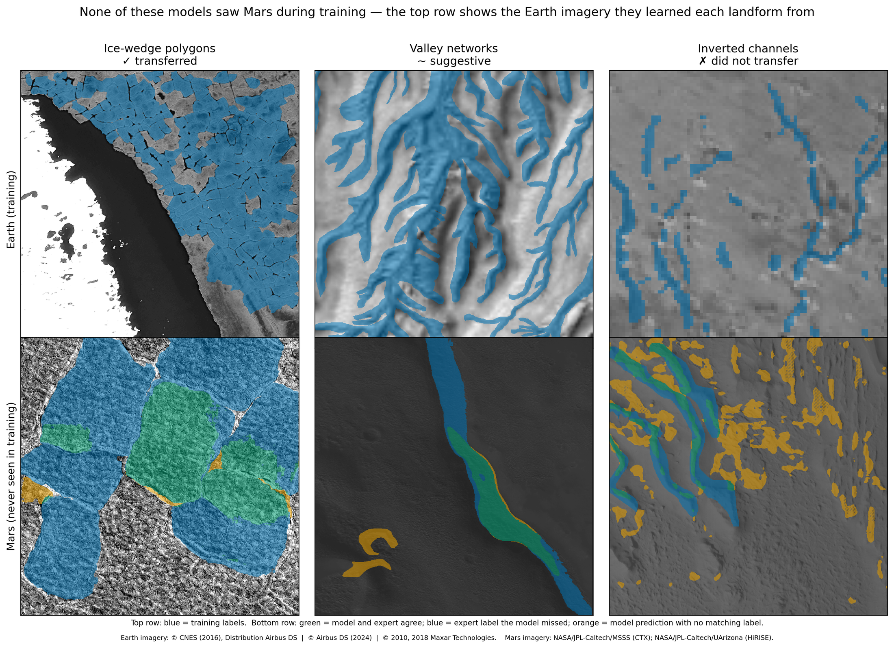
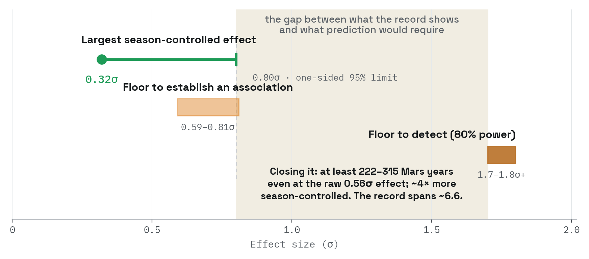

```{=html}
<canvas class="site-field" aria-hidden="true"></canvas>

<div class="page-head">
  <div class="page-head-inner">
    <div class="kicker">Projects</div>
    <h1>Where I've pointed AI</h1>
    <p>Three problems: two in imagery, one that has no images in it at all. Each
    entry states the problem, what I built, and where the result currently stands.
    Status labels are literal. Work that is unpublished or in preparation is marked
    as such, and limitations are stated alongside results.</p>
  </div>
</div>

<div class="sheet">

<div class="band-narrow">

  <div class="entry">
    <h3>Martian paleoclimate by counting cracks</h3>
    <p>Frozen ground on Mars cracks into polygons much as it does on Earth, and the
    way those cracks meet is a record of what the climate did. A crack that stops
    against another says the ground cracked once, in sequence. Three cracks meeting
    symmetrically say it froze and thawed repeatedly. Cracks that run straight
    through each other say ice filled the older fractures before new ones opened.</p>

    <p>Mars has more than 100,000 orbital images. Junction types have been surveyed
    by hand exactly once. I built a pipeline that finds these junctions and
    classifies them, labeling 84% correctly overall and 75% when the four types are
    weighted equally, since the rarer types are the hard ones. It needs as few as 25
    to 50 junctions to tell one terrain from another.</p>

    <p>On 19 images of western Utopia Planitia, Mars, the junction mix shifts with
    latitude as predicted, and aligns with an independent ice-stability proxy also
    used for paleoclimate interpretation. This is a climate signal recovered at a
    scale hand-mapping cannot realistically reach.</p>

    <p>A planet's worth of imagery is far too much to download, so the pipeline
    reads only the small piece of each image it needs, directly from the archive,
    and finds its own inputs rather than being handed a list. Before that change
    shipped I checked it against the old approach to confirm the results came out
    identical. It runs on rented GPU capacity that can be taken away mid-job, with
    a spending cutoff so an unattended run cannot get away from me.</p>

    <div class="entry-stage">
      <div class="stage-frame">
        
        
        
        
      </div>
      <ol class="stage-ticker">
        <li class="stage-step is-on" data-i="0" tabindex="0">01 Raw tile</li>
        <li class="stage-step" data-i="1" tabindex="0">02 Mask</li>
        <li class="stage-step" data-i="2" tabindex="0">03 Skeleton</li>
        <li class="stage-step" data-i="3" tabindex="0">04 Junctions</li>
      </ol>
    </div>

    <p class="caveat">The classification method and pilot deployment are under
    review at JGR: Machine Learning and Computation, submitted April 2026, not yet
    accepted. The planet-scale deployment is in preparation. Train and test splits
    for the detector are made at the tile level, so adjacent tiles from the same
    image can appear in both, and its performance should be read as an upper bound
    on generalization to unseen scenes. An earlier version of the classifier had a
    leakage problem between the training and evaluation splits; I found it, and the
    full eight-method model stack was rebuilt and re-evaluated on clean data.</p>

    <p class="links"><span>Code released on acceptance</span></p>
    <span class="entry-label">Under review · scale-up in progress</span>
  </div>

  <div class="entry">
    <h3>Training on Earth, deploying on Mars</h3>
    <p>Can an AI model trained only on satellite images of Earth recognize the same
    kinds of landforms on Mars? Geologists have reasoned this way for over a century,
    reading martian terrain through its closest Earth counterparts, and this project
    asked whether that reasoning survives being handed to a machine. I trained
    image-segmentation models on three Earth landform types: polygon-patterned tundra
    in the Arctic, ancient riverbeds preserved as ridges, and branching valley
    networks. Then I set them loose on Mars orbital imagery, asking two questions.
    Where does the Earth analogy hold, and what, if anything, still has to come from
    Mars?</p>

    <p>The three landforms gave three different answers. Valley networks hinted at
    real transfer, but the handful of well-mapped martian examples was too small to
    prove it. The ridged riverbeds were the hard failure: at the resolution of
    Mars-wide imagery, a model trained on Earth did no better than one that simply
    labels the entire image a riverbed. The polygonal terrain succeeded. An
    Earth-trained model found martian ice-wedge polygons that the same model,
    stripped of its Earth training, could not, and that margin is the analogy's
    contribution, isolated.</p>

    <p>So what crossed the planetary gap, and what didn't? Earth taught the models
    what these landforms look like. What Earth could not supply was scale: the
    martian examples in our data are several times larger than the terrestrial ones
    the models trained on, a mismatch between the datasets we could measure, whatever
    it reflects about the planets. Adding martian training data improved every model,
    on every landform. And one experiment showed how badly the alternatives fail:
    taught only from its own mistakes, a model concluded that Mars had no such
    landforms at all, while staying just as accurate on Earth. Earth can teach a
    model what a landform looks like. Teaching it what that landform looks like on
    Mars is a separate problem.</p>

    
    <p class="figcaption">Top row: Earth imagery the models trained on, blue showing training labels.
    Bottom row: Mars, never seen in training. Green marks agreement between model and expert, blue marks
    expert labels the model missed, orange marks model predictions with no matching label. Earth imagery
    &copy; CNES (2016), Distribution Airbus DS; &copy; Airbus DS (2024); &copy; 2010, 2018 Maxar Technologies.
    Mars imagery NASA/JPL-Caltech/MSSS (CTX) and NASA/JPL-Caltech/UArizona (HiRISE).</p>

    <p class="result">Quantitative results withheld pending publication. For scale
    of the problem: on Earth alone, detection performance for polygonal terrain falls
    by roughly two thirds when a model is moved between sensors (Zhang et al., 2020).
    The Earth-to-Mars gap spans planet, sensor, and resolution at once.</p>

    <p class="links">
      <a href="https://www.hou.usra.edu/meetings/lpsc2026/pdf/1717.pdf">LPSC 2026 abstract 1717</a>
      <span>Code not yet released</span>
    </p>
    <span class="entry-label">Results in preparation</span>
  </div>

  <div class="entry">
    <h3>Knowing a record's limit</h3>
    <p>Can a Martian dust storm be predicted? Researchers have spent decades hunting
    for the signals that precede major storms, and many candidates have been reported,
    but none has yet been shown to outperform the two forecasts that come for free:
    the season's usual storm rate, and the conditions already prevailing. That led me
    to ask whether the existing storm record contains enough information to prove that
    a precursor signal beats those free forecasts.</p>

    <p>It does not. Mars has produced only about a dozen independent major storms
    since continuous observation began, far too few to tell a working forecast from a
    lucky one. The more tractable question, and the one I am testing now, is whether
    a storm already underway can be predicted to keep growing.</p>

    <p>For mission planners this turns an open question into a concrete number. Storm
    risk on Mars must, for now, rest on seasonal climatology, and any future forecast
    claim can be checked against the bar this work sets before anyone acts on it.</p>

    
    <p class="figcaption">The measured signal falls short of the bar it would have to clear.
    Point and whisker: largest season-controlled effect measured, with its one-sided 95% upper
    limit. Bands: the effect size this record and design would need to establish an association,
    and to detect a precursor at 80% power. Closing the gap by observation would take at least
    222 to 315 Mars years; the usable record spans about 6.6.</p>

    <p class="result">For this record and design, detecting a precursor at 80%
    power requires roughly 1.7σ, or 1.8σ and above once storm clustering is
    counted. The largest season-controlled effect measured is 0.32σ, with a
    one-sided 95% upper limit of 0.80σ. Closing that gap by observation would
    take at least 222 to 315 Mars years, and roughly double that once
    clustering is counted; the usable record spans about 6.6.</p>

    <p class="caveat">This is a predictability assessment and not a forecasting
    system. Methods and decision thresholds were committed to version control before
    each run, so the commit history is the record that nothing was decided after
    seeing results. One run was killed mid-flight when a check caught rows reading
    atmospheric data from after the event being predicted; no result was read before
    the fix, so the added robustness tests are provably not after the fact. Every floor statement is scoped to its design. The nulls exclude
    effects large enough to support prediction for the features and estimands
    tested; they are not evidence that precursors do not exist.</p>

    <p class="links"><span>Pre-registration and code: Zenodo deposit forthcoming</span></p>
    <span class="entry-label">In preparation</span>
  </div>


</div>
</div>
```
